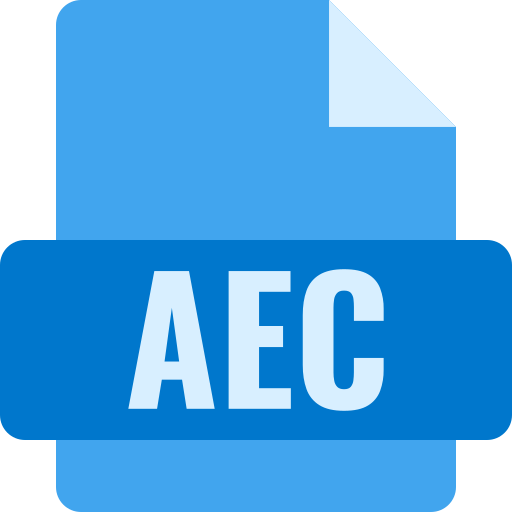
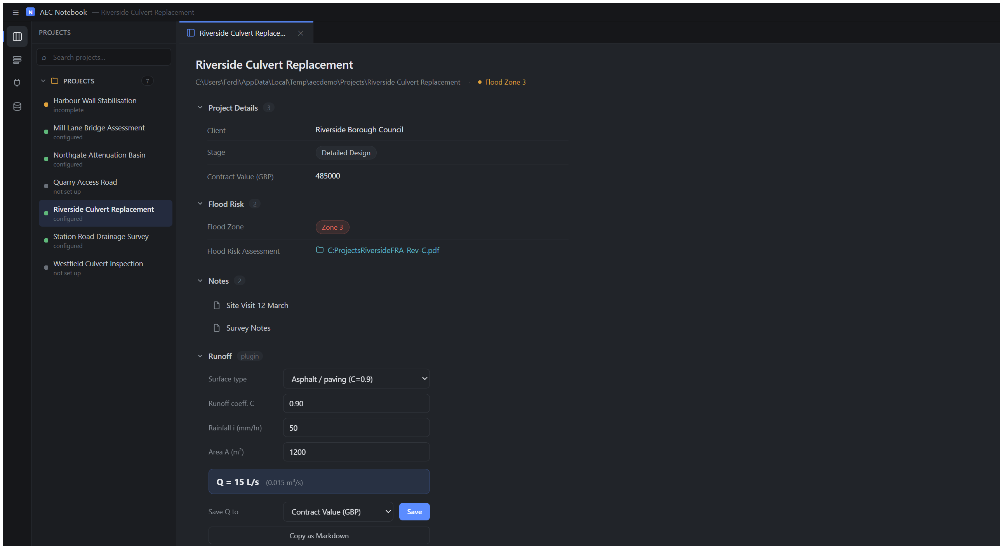
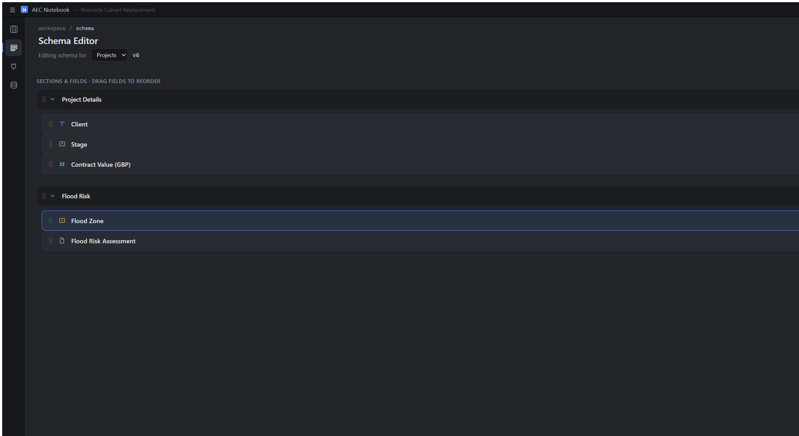
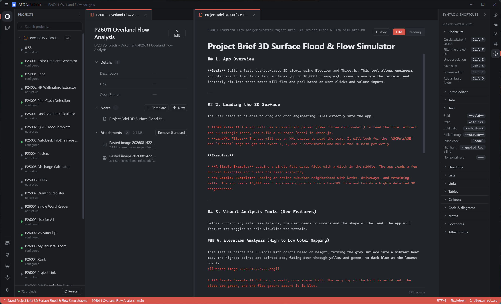
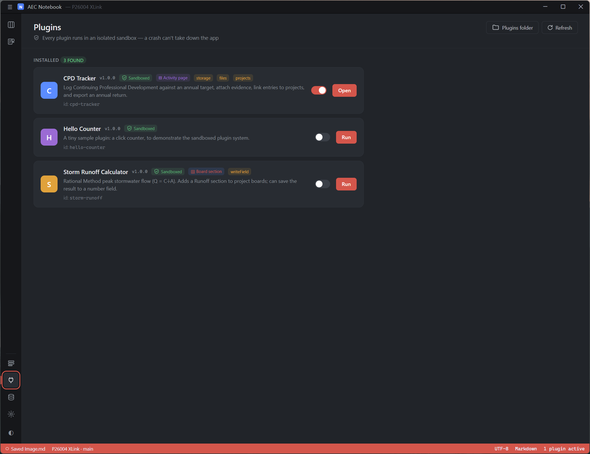

<div align="center">



# AEC Notebook

**Turn the project folders you already have into a searchable, structured notebook.**

Point it at your projects drive. Define the fields *you* care about. Keep site notes beside the
work they describe — in plain JSON and Markdown you can still open without this app.

[Download](#download) · [Getting started](#getting-started) · [Writing plugins](PLUGINS.md) ·
[Contributing](CONTRIBUTING.md)

</div>



---

## The problem it solves

A structured note system that engineers, architects and other disciplines can capture their knowledge/notes/experience on a project.
AEC Notebook puts both next to the folder itself. Your files never move, and nothing is locked in:
project data is a `project.json` you can read and diff, notes are ordinary `.md` files.

## What it does
**Describe your projects however you like.** Every library folder gets its own field definitions —
text, number, date, select, multi-select, file, checkbox — grouped into sections you can drag to
reorder. Export a schema as JSON and reuse it on the next drive.



**Validation that reflects how you actually work.** Required fields, min/max, allowed options — and
cross-field rules. Here, selecting *Zone 3* demands a flood risk assessment on file before the
project counts as complete, and flags the field in red until it has one.

**Site notes that link to each other.** Markdown with `[[wikilinks]]`, `#tags`, backlinks, and
drag-and-drop attachments. Rename a note and it offers to repoint every link to it. Edit a note in
another editor and the app notices instead of overwriting you.



**Extend it without forking it.** Plugins are a folder with a manifest and one JavaScript file.
They run in an isolated sandbox with no network and no filesystem access, and can only touch
project fields you've granted them. A broken plugin can't take the app down.



**Plus:** a tabbed workspace with split panes and session restore · full-text search and a
`Ctrl/Cmd+P` quick switcher · a spreadsheet-style table view of every project in a folder,
exportable to CSV · version history for every note · light and dark themes, with font, size,
spacing, column width and accent colour all adjustable — and a `custom.css` for anything else.

Not sure of the syntax? The **Syntax & shortcuts** pane on the right lists all of it, and clicking
a snippet copies it.

## Download

Grab an installer from the [**Releases page**](../../releases/latest):

| Platform | File |
| --- | --- |
| Windows | `AEC Notebook Setup <version>.exe` |
| macOS | `AEC Notebook-<version>.dmg` |
| Linux | `.AppImage` or `.deb` |

Installers are **not code-signed**, so Windows SmartScreen and macOS Gatekeeper will warn on first
run. On Windows choose *More info → Run anyway*; on macOS right-click the app and choose *Open*.
See [SECURITY.md](SECURITY.md).

Prefer to build it yourself? See below.

## Build from source

Requires Node.js 20+.

```bash
npm install
```

```bash
npm start
```

Run the tests:

```bash
npm test
```

Build installers for the current platform (output in `dist/`, which is not tracked in git —
binaries are published through Releases instead):

```bash
npm run dist
```

## Getting started

1. Open the **Storage** page from the left ribbon and add a *library folder* — a folder that
   contains project folders. Set how many levels deep the projects sit (1 = direct subfolders).
2. Open the **Schema Editor** and define the fields for that folder.
3. Pick a project in the left panel, hit **Edit**, and fill it in. Everything auto-saves.

## Where your data lives

Two things are stored separately.

**Per-project data** (`project.json` + `notes/*.md` + `attachments/`) goes wherever you choose on
the Storage page:

| Mode | Location |
| --- | --- |
| In folder *(default)* | `<project>/ProjectNotes/` |
| Central | `<userData>/Projects/<Project Name (id)>/` |
| Custom | `<your folder>/ProjectNotes/Projects/<Project Name (id)>/` |

**App config** (`settings.json`, `library.json`, `schemas.json`, `session.json`, `plugins.json`)
always lives in the platform's user-data directory:

| Platform | Path |
| --- | --- |
| Windows | `%APPDATA%\AEC Notebook` |
| macOS | `~/Library/Application Support/AEC Notebook` |
| Linux | `~/.config/AEC Notebook` |

Set `PNOTES_HOME` to override that (useful for testing against a throwaway directory).

Switching storage mode does not move anything automatically — use **Copy data in…** on the Storage
page, which copies from your other locations and leaves the originals as a backup.

## Plugins

Plugins add tools to your project boards — a runoff calculator, a fee estimator, a unit converter —
and can write results straight back into project fields. Each one is a folder with a
`manifest.json` and a single JavaScript file. No build step.

**To install one:** open the **Plugins** page in the left ribbon, click **Plugins folder**, drop the
plugin's folder in, and click **Refresh**. That button opens the right directory for your install
and creates it if needed:

| Platform | Path |
| --- | --- |
| Windows | `%APPDATA%\AEC Notebook\plugins` |
| macOS | `~/Library/Application Support/AEC Notebook/plugins` |
| Linux | `~/.config/AEC Notebook/plugins` |

Plugins run in an isolated sandbox with **no network and no filesystem access**, so a plugin can't
read your files or phone home — but it can write to the project it's mounted on if you install one
that declares the `writeField` permission. Install plugins you trust.

**To write one:** see **[PLUGINS.md](PLUGINS.md)** for the full guide — a five-minute starter
plugin, the manifest format, the `PluginAPI` reference, styling, sandbox limits, and
troubleshooting. `plugins/storm-runoff/` is a complete worked example.

## Architecture

```
src/main/       Electron main process — persistence, scanning, search index, plugin loading
  main.js         app lifecycle, window, navigation guards, pnplugin:// scheme
  menu.js         the native application menu
  pathGuard.js    the allowlist every project-scoped IPC call is checked against
  writeTracker.js holds app quit open until pending writes land
  preload.js      the entire renderer-facing API surface
  ipc/            one module per area (notes, project, config, search, plugins, …)
  services/       storage, scanner, search, searchIndex, watcher, plugins, pluginHost
src/shared/     Pure logic usable from either process (data_validation.js, theme.js)
renderer/       UI — no Node access; everything goes through window.api
  styles/         design tokens + per-area stylesheets
  core/           store, toast, modal, undo, fsWatch, icons, events
  workspace/      tab groups, splitting, session layout
  editor/         note editor, markdown rendering, attachments
  views/          project board, schema editor, table, storage, quick switcher
  plugins/        host side of the sandboxed plugin bridge
plugins/        Bundled sample plugins
test/           node:test unit tests
```

Security posture: `contextIsolation` on, `nodeIntegration` off, a channel-allowlisted preload, a
strict CSP on the app document, external links forced out to the system browser, and plugins
isolated behind a separate protocol scheme with their own CSP.

## Contributing

Issues and pull requests are welcome. Please run `npm test` before opening a PR.

## License

MIT — see [LICENSE](LICENSE). Copyright (c) 2026 Civil Teach Source Group Limited.
